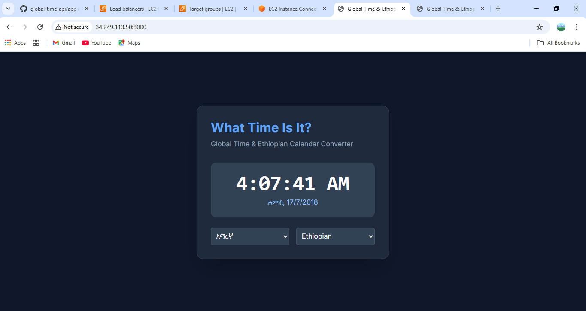
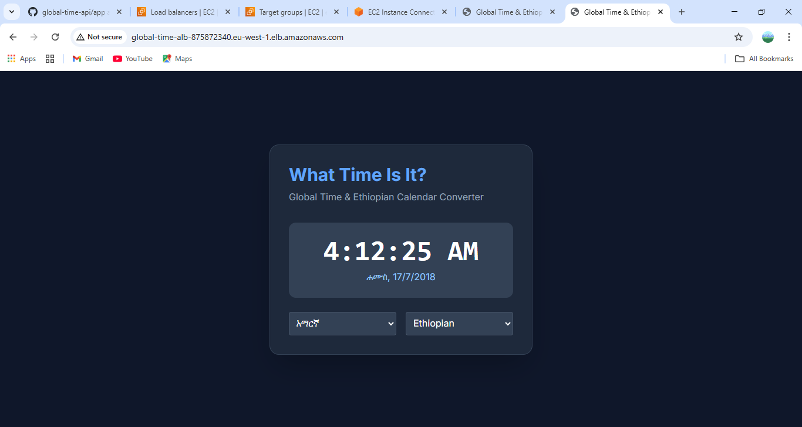
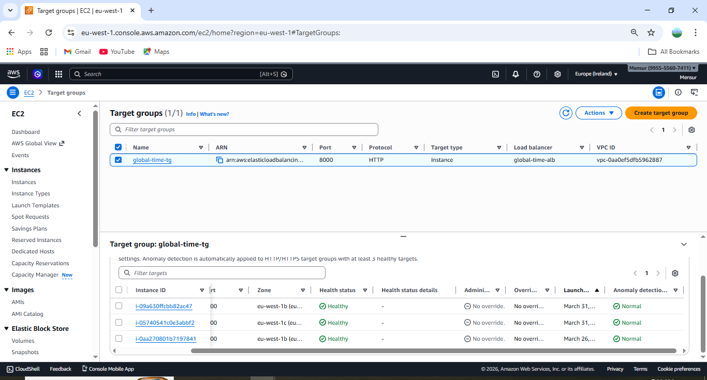

# 🌍 Global Time & Calendar API

A production-style FastAPI application deployed on AWS using a scalable and highly available architecture.

This project provides a real-time web dashboard and API for global time tracking with multilingual and multi-calendar support.


## 🚀 Features

- **🌐 Global timezone support (via pytz)**
- **🗓️ Gregorian & Ethiopian calendar conversion**
- **🌍 Multilingual day names (English + Amharic)**
- **🎨 Interactive UI (Tailwind CSS + Jinja2)**
- **☁️ Deployed on AWS with scalability and fault tolerance**
## ☁️ AWS Architecture

## 🔧 Services Used
- **Amazon EC2 (compute)**
- **Elastic Load Balancer (traffic distribution)**
- **Auto Scaling Group (dynamic scaling)**
- **Launch Templates (automated instance setup)**
- **Security Groups (network control)**
- **Multi-AZ deployment (high availability)**

## 💡 Key Cloud Concepts Demonstrated
- **High Availability (Multi-AZ deployment)**
- **Fault Tolerance (auto-replacement of failed instances)**
- **Scalability (automatic instance scaling)**
- **Load Distribution (via Load Balancer)**
- **Infrastructure as Code mindset (user data automation)**
- **Secure architecture (restricted EC2 access)**

## 🌐 Live Access

Access the application via Load Balancer:

http://<global-time-alb-875872340.eu-west-1.elb.amazonaws.com>

## 📁 Project Structure

```text
global-time-api/
├── app/
│   ├── main.py          # Backend logic & API routes
│   ├── static/          # CSS and frontend assets
│   └── templates/       # HTML UI (Jinja2)
├── .gitignore           # Git exclusion rules
├── README.md            # Project documentation
└── requirements.txt     # Python dependencies

 ```

## 📌 API Endpoints

### 1. Get Current Time
GET /time?timezone=Africa/Addis_Ababa

### 2. Get Today Info
GET /today

Query Parameters:
- timezone: (e.g., Africa/Addis_Ababa)

- lang: en or am

- calendar: gregorian or ethiopian

Example:
GET /today?calendar=ethiopian&lang=am

## 🛠️ Tech Stack

- Backend: FastAPI, Uvicorn

- Templating: Jinja2

- Styling: Tailwind CSS (CDN)

- Libraries: pytz, ethiopian-date

## ▶️ Run Locally

** 1. Clone the repository: **
```bash
git clone [https://github.com/mensurmm/global-time-api.git](https://github.com/mensurmm/global-time-api.git)
cd global-time-api

```
**2. Set up the Virtual Environment:**

```bash
python -m venv venv
# On Windows:
venv\Scripts\activate
# On macOS/Linux:
source venv/bin/activate

```
**3. Install Dependencies:**
```bash
pip install -r requirements.txt
```
**4. Start the Server:**
```bash
uvicorn app.main:app --reload 

```
---

**5. Access the App:**
Open in browser
```bash

http://127.0.0.1:8000 
``` 
## 📸 Screenshots

# 🔹 Dashboard UI

Add screenshot here (save inside repo as /screenshots/ui.png)




# 🔹 Target Group (healthy)


---

## 🧠 What I Learned
- **Designing scalable cloud architectures on AWS**
- **Deploying backend services to EC2**
- **Configuring Load Balancers and Auto Scaling**
- **Debugging real-world cloud issues (health checks, user data, security groups)**

## 🚀 Future Improvements
- **Custom domain using Route 53**
- **HTTPS (SSL certificate)**
- **CI/CD pipeline**
- **Containerization (Docker)**
👨‍💻 Author

# Built as part of AWS Solutions Architect learning journey.
